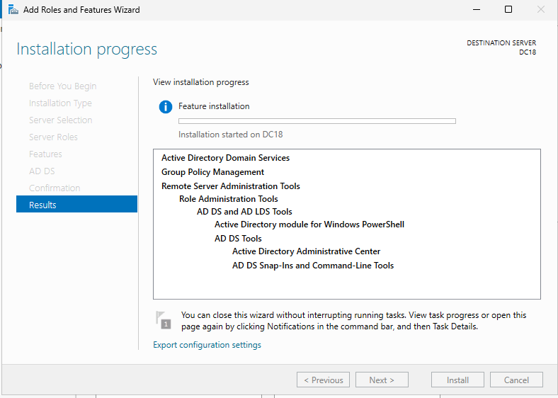

# GUIA EXAMEN FUGA
## 1 AFEGIR UN DOMINI AL SERVIDOR (SEXO)

### 2.4 Intalacio del Rol Domine service
Lo primer que ferem es entrar a la part de Manager, I entrar hon diu add Roles and features

Segint d'l apartatde installation Type

Next..

Permet Insta-lar roles de forma centrelitzada als diferents servidors del domini. 

Next...

Next...

Confirmation...

INSTALL..

## 2.5 Promoció a domain controller

Entrem on diu Promote this server to a domain controller

I selecionem el tipus de instalacio que volem fer,
Ens pregunta si volem afegir a undomini que ja existeix,

Next...

El nivell funcional de bosc i domini 

next...

Com utilitza DNS i no detecta cap operatiu que contingui el domini triat, ens avisa i procedirà a instal·lar aquest rol al DC. Cliquem directament a Next

next...

Per compatibilitat amb sistemes que encara usen NetBIOS (Samba3, XP en grup de treball...) assigna automàticament un nom NetBIOS al domini.

next....

next..

Ens mostra un resum de les configuracions triades i dóna l’opció de crear un script PowerShell amb elles. Això és molt útil per replicar configuracions.

Instala..

## POSAR UN EQUIP EN DOMINI
### Configurar el DNS del cliente

Abre Configuración → Red e Internet
En Ethernet o WiFi → Editar configuración del adaptador
Haz clic derecho → Propiedades
Selecciona Protocolo de Internet versión 4 (TCP/IPv4)
En DNS, coloca:

Servidor DNS preferido: IP del servidor (ej. 192.168.1.10)

