# t07 TransLògic: Administració Avançada i Seguretat Corporativa
 ## 1.1. Política Global (Default Domain Policy)
 Passos:
Obre Group Policy Management.

Ves a: Domains → translogic.local → Default Domain Policy.

Clic dret → Edit.
Navega a:
Computer Configuration →
Policies →
Windows Settings →
Security Settings →
Account Policies →
Password Policy

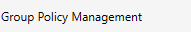

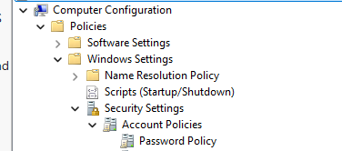

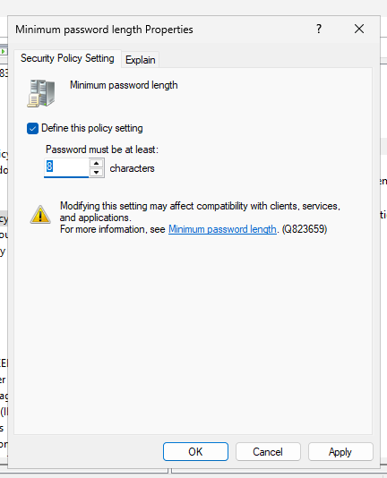

## 1.2. Política per al grup Gerencia

Objectiu:

Contrasenya mínima: 18 caràcters
Caducitat: 28 dies
Sense complexitat

Passos:

A Group Policy Management: clic dret a l’OU Gerencia → Create a GPO…
Nom: GPO_Password_Gerencia.
Edit.
Navega a la mateixa ruta que abans.

Configura:

Minimum password length = 18
Maximum password age = 28 days
Password must meet complexity requirements = Disabled

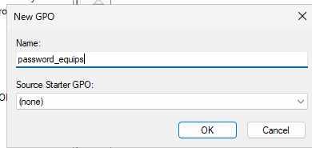

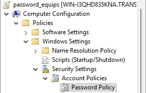

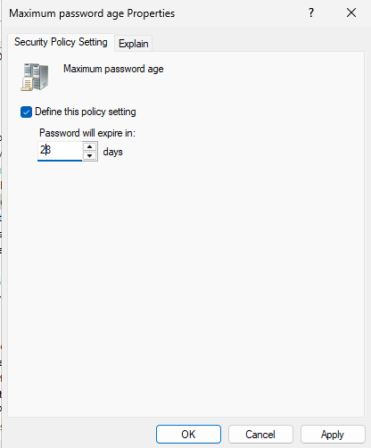

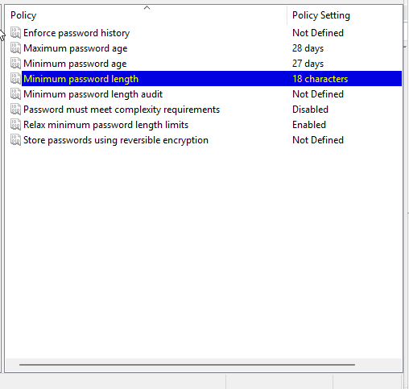

## 1.3. Millora Proactiva (Bonus GPO)

Passos:

Clic dret a l’OU Magatzem → Create new GPO.

Nom: GPO_Bloqueig_Magatzem.
Edit.

Navega a:

User Configuration →
Policies →
Administrative Templates →
Control Panel →
Personalization

Configura:

Screen saver timeout = 300 (5 minuts)
Password protect the screen saver = Enabled
Enable screen saver = Enabled

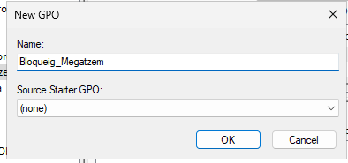

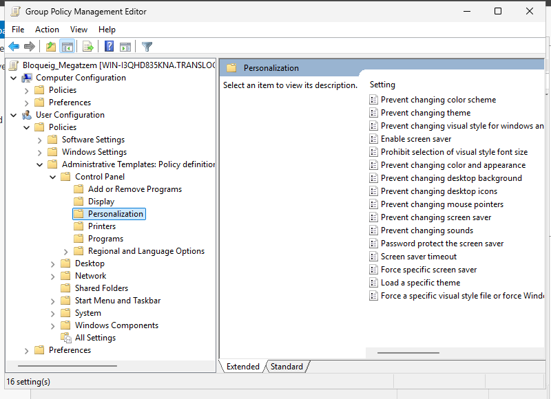

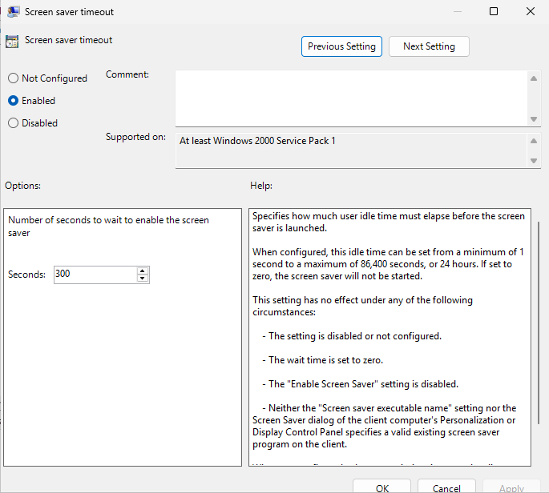

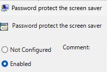

## 2.1. Desplegament de 7zip per al Departament de Gestió

 Requisit:
Col·loca el fitxer .msi de 7zip en una carpeta compartida accesible (ex: \\SERVER\SOFT\7zip\7zip.msi).

Passos:

Crea una nova GPO: GPO_7zip_Gestio.

Edit.
Navega:
Computer Configuration →
Policies →
Software Settings →
Software Installation

Clic dret → New → Package…

Selecciona el msi via ruta UNC (\\server\soft\7zip.msi).
Tria “Assigned”.
Enllaça la GPO a l’OU Gestio.

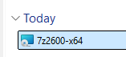

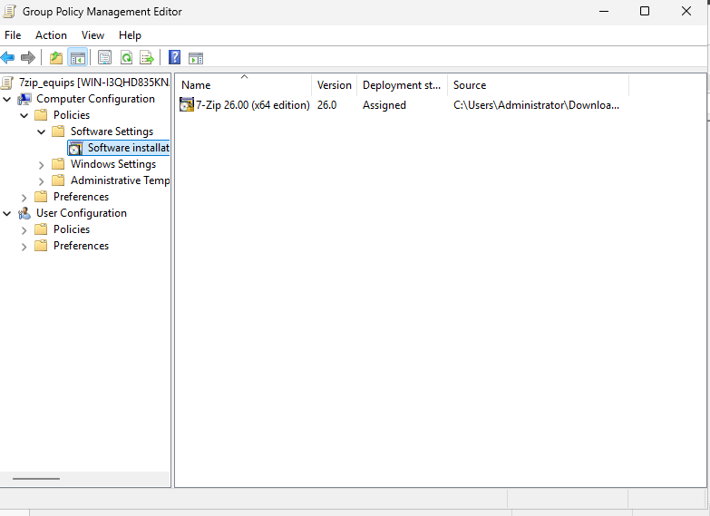

## 2.2 Gerència (grup gerencia) → Firefox publicat (l’usuari decideix)
Passos (GPMC)

Crea GPO_Software_Gerencia_Firefox.
Enllaça-la a TransLogic\_Users\gerencia.
Edita:

User Configuration → Policies → Software Settings → Software installation → New → Package…
Selecciona \\SRV-FS\software$\firefox\Firefox-x64.msi.
Tria Published.

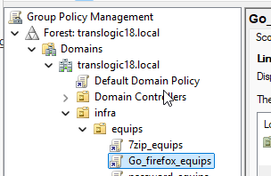

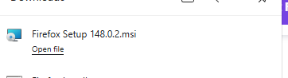

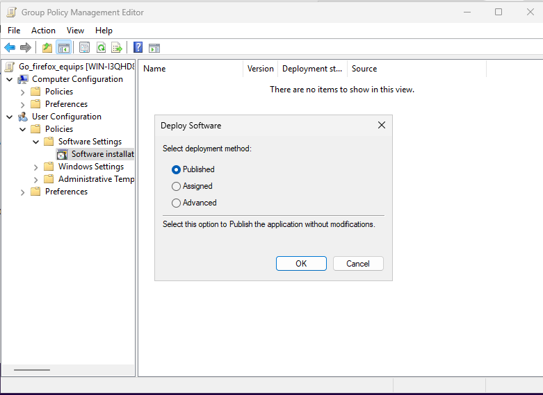

## 2.3 Pregunta de consultoria: Com crear MSI si només tenim .exe?
Embalatge/Reempaquetat (Repackaging)

Eines com Advanced Installer, EMCO MSI Package Builder, Pace Suite o RayPack poden capturar instal·lació EXE i generar un MSI (o MSIX).
Avantatges: MSI nadiu per GPO; personalització amb MST.
Inconvenient: Llicències i cura amb detecció de canvis.

## 3. Mobilitat d’Usuaris (Perfils Mòbils)

Pasos
Crear carpeta
En el servidor de ficheros: crea D:\Perfils.

Compartir (SMB)

Clic derecho → Propiedades → pestaña Compartir → Uso compartido avanzado…
Marca Compartir esta carpeta.
Nombre del recurso: perfils$ (el $ la oculta).
Permisos (Share): Everyone = Full Control.
Caché / Archivos sin conexión: No files or programs from the share are available offline.

Seguridad NTFS (en la carpeta)

Pestaña Seguridad → Opciones avanzadas.
Deshabilitar herencia (y convertir si aparece).
Dejar estas ACE:

Administrators — Full Control — Esta carpeta, subcarpetas y archivos
SYSTEM — Full Control — Esta carpeta, subcarpetas y archivos
CREATOR OWNER — Full Control — Solo subcarpetas y archivos

Quitar Users/Domain Users de la carpeta raíz (o sin permisos).
(Opcional, recomendable) Añadir Authenticated Users con Listar + Crear carpetas solo en “Esta carpeta” para que el usuario pueda crear su subcarpeta en el primer inicio.
