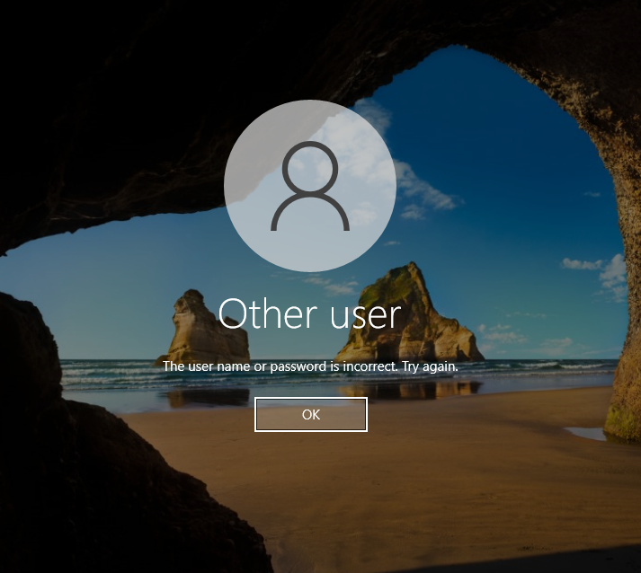

# t08 Guia d’Auditoria i Monitorització – Windows Server
## 1️⃣ Monitorització de Recursos
S’utilitza el **Gestor de tasques** per comprovar l’ús de la CPU i la memòria RAM.  
Aquesta revisió permet valorar si el servidor funciona correctament o està saturat.

## 2️⃣ Configuració de l’Auditoria de Seguretat
Mitjançant la **Política de seguretat local** (`secpol.msc`) s’activa l’auditoria d’inicis de sessió.  
Es registren tant els accessos correctes com els fallits per detectar activitat sospitosa.

## 3️⃣ Simulació d’Incidents (Hacking Ètic)
Es fan diversos intents d’inici de sessió amb contrasenya incorrecta.  
A continuació, s’accedeix correctament com a administrador.

## 4️⃣ Anàlisi Forense (Visor d’Esdeveniments)
Amb el **Visor d’esdeveniments** (`eventvwr.msc`) es revisen els registres de seguretat.  
Els intents fallits queden registrats amb l’**Event ID 4625**.

